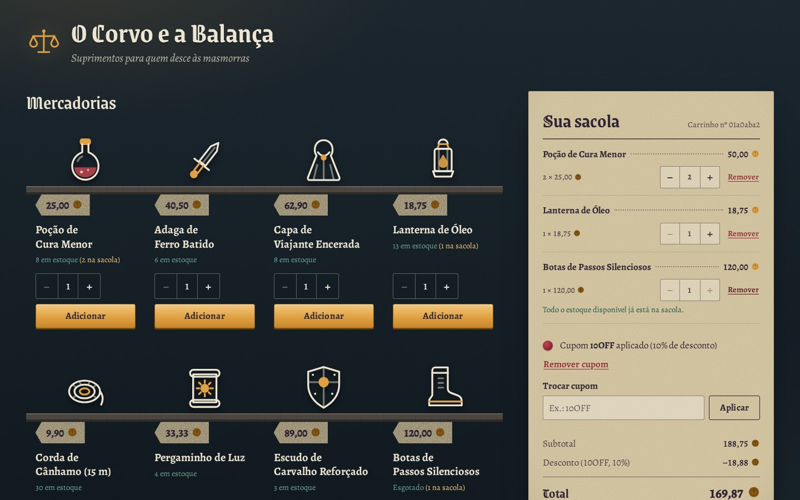
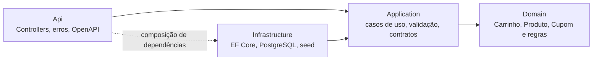
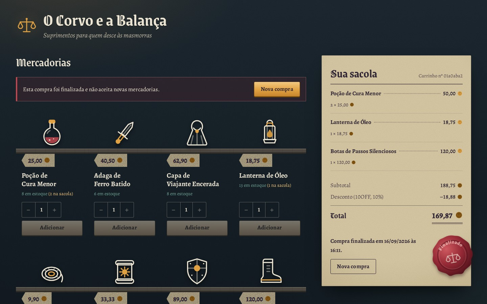
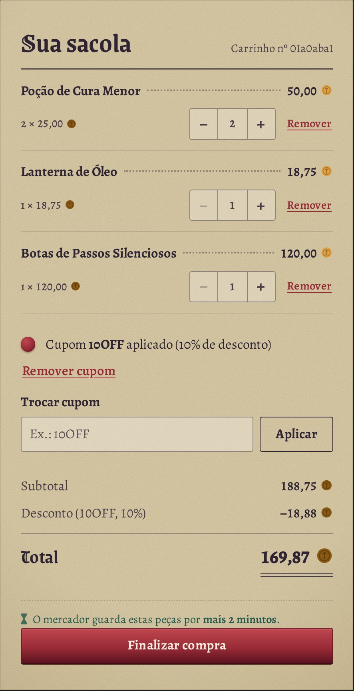
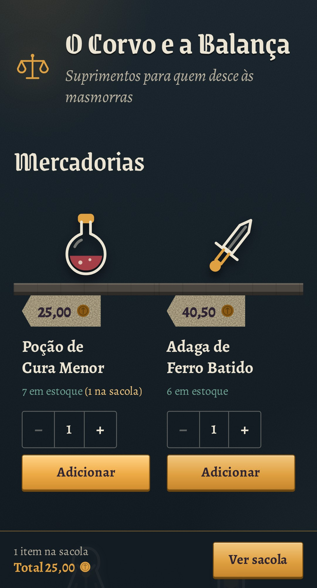

# O Corvo e a Balança — Carrinho de Compras

API REST de carrinho de compras em **.NET 10** (ASP.NET Core + EF Core + PostgreSQL) com um front-end **React** que a consome: catálogo com estoque, sacola com itens e quantidades, cupom de desconto, cálculo de subtotal/desconto/total e checkout.

O estoque é **reservado enquanto a mercadoria está na sacola**: ela sai da vitrine para todo mundo, volta se o item sair ou se a sacola ficar parada além do prazo, e vira baixa definitiva no checkout.



## Sumário

- [Stack](#stack)
- [Como rodar](#como-rodar)
  - [Com Docker (tudo de uma vez)](#opção-1--docker-tudo-de-uma-vez)
  - [Local, para desenvolvimento](#opção-2--local-para-desenvolvimento)
  - [Configuração do banco de dados](#configuração-do-banco-de-dados)
- [Testes](#testes)
- [API](#api)
  - [Contrato de erro](#contrato-de-erro)
  - [Exemplos de chamadas (.http e Postman)](#exemplos-de-chamadas)
- [Arquitetura](#arquitetura)
- [Decisões de design](#decisões-de-design)
- [Premissas assumidas](#premissas-assumidas)
- [Front-end](#front-end)
- [Próximos passos](#próximos-passos)

## Stack

| Parte | Tecnologias |
|---|---|
| API | .NET 10, ASP.NET Core (Controllers), FluentValidation, OpenAPI + Swagger UI |
| Persistência | PostgreSQL 18, Entity Framework Core 10 (Npgsql), migrations |
| Front-end | React 19, Vite 8, TypeScript, TanStack Query, CSS Modules |
| Testes | xUnit v3, Shouldly, Testcontainers, WebApplicationFactory, Vitest, Testing Library, MSW, Playwright |
| Infra | Docker (imagens multi-stage, sem root), Docker Compose, GitHub Actions |

---

## Como rodar

### Opção 1 — Docker (tudo de uma vez)

Pré-requisito: Docker com Compose v2.

```bash
docker compose up --build
```

| O quê | Endereço |
|---|---|
| Loja (front-end) | http://localhost:3000 |
| API + Swagger | http://localhost:5080/swagger |
| Documento OpenAPI | http://localhost:5080/openapi/v1.json |
| Health check | http://localhost:5080/health |
| PostgreSQL | `localhost:5432` — banco `carrinho_compras`, usuário `carrinho`, senha `carrinho` |

O Compose sobe, em ordem: `db` (espera ficar saudável) → `migrations` (aplica o esquema e o catálogo e termina) → `api` → `web` (nginx servindo o front e repassando `/api` para a API).

- Parar: `docker compose down` (com `-v` apaga também os dados do banco).
- Portas ou credenciais diferentes: copie `.env.example` para `.env` e ajuste.

### Opção 2 — Local, para desenvolvimento

Pré-requisitos: [.NET SDK 10](https://dotnet.microsoft.com/download), Node.js 22.12+ (ou 24) e um PostgreSQL (o do Compose serve).

**1. Banco de dados**

```bash
docker compose up -d db
```

**2. API** (http://localhost:5080, Swagger em `/swagger`)

```bash
cd backend
dotnet tool restore
dotnet run --project src/CarrinhoCompras.Api
```

Em `Development`, a API aplica as migrations e sincroniza o catálogo ao iniciar.

**3. Front-end** (http://localhost:5173)

```bash
cd frontend
npm install
npm run dev
```

O Vite repassa as chamadas `/api` para `http://localhost:5080` (sem CORS). Para outra URL da API: `API_PROXY_TARGET=http://host:porta npm run dev`. No WSL, com o projeto em `/mnt/*`, use `VITE_USE_POLLING=true npm run dev` para o recarregamento automático funcionar.

### Configuração do banco de dados

- **Connection string** `ConnectionStrings:CarrinhoCompras`:
  - local: `backend/src/CarrinhoCompras.Api/appsettings.Development.json` (aponta para o PostgreSQL do Compose em `localhost:5432`);
  - Docker ou outro ambiente: variável de ambiente `ConnectionStrings__CarrinhoCompras`.
- **Migrations manualmente** (a partir de `backend/`):
  ```bash
  dotnet ef database update --project src/CarrinhoCompras.Infrastructure --startup-project src/CarrinhoCompras.Api
  ```
- **Catálogo:** `backend/src/CarrinhoCompras.Infrastructure/Persistence/Seed/produtos.json` e `cupons.json`. Ao aplicar as migrations, o catálogo do banco é sincronizado com esses arquivos pelo `id` (insere o que falta, atualiza o que mudou). Para usar outros dados, basta substituir os arquivos e rodar as migrations de novo.
- **Reposição do catálogo:** o seed devolve `QuantidadeEstoque` aos valores do JSON (as compras finalizadas baixam o estoque de verdade). Para repor a loja, rode as migrations de novo — com a API parada, porque o seed não sobrescreve um sistema em uso:
  ```bash
  docker compose stop api && docker compose up -d --force-recreate migrations && docker compose start api
  ```
- **Prazo da reserva:** `Carrinho:JanelaDeReserva` (variável `Carrinho__JanelaDeReserva`, formato `hh:mm:ss`). O padrão de negócio é **15 minutos**; o `docker compose` usa **2 minutos** (`RESERVA_JANELA` no `.env`) para dar para ver a reserva voltar à vitrine sem esperar.
- **Consultas manuais:** as tabelas e colunas usam PascalCase, então no PostgreSQL vão entre aspas:
  ```bash
  docker compose exec db psql -U carrinho -d carrinho_compras -c 'SELECT * FROM "Produto";'
  ```

---

## Testes

```bash
cd backend && dotnet test --solution CarrinhoCompras.slnx   # domínio, arquitetura e integração
cd frontend && npm run test:run                             # front-end
```

| Suíte | Testes | O que cobre |
|---|---:|---|
| `CarrinhoCompras.Domain.Tests` | 86 | Regras e cálculos: carrinho vazio, com e sem cupom, quantidades alteradas, troca de cupom, arredondamento, **reserva e devolução de estoque**, expiração da sacola, bloqueio após checkout |
| `CarrinhoCompras.ArchitectureTests` | 8 | O domínio não depende de nenhuma outra camada nem de pacotes; a Application não depende de EF Core/ASP.NET |
| `CarrinhoCompras.Api.IntegrationTests` | 82 | A API real contra PostgreSQL real: catálogo igual ao JSON, nomes e tipos das colunas, fluxos, **formato de todos os erros**, reserva de estoque sob requisições simultâneas, concorrência, OpenAPI |
| Front-end (Vitest) | 25 | Cliente HTTP, formatação, componentes e o fluxo completo da página com a API simulada |
| Interface (Playwright) | 11 | O navegador contra a stack de verdade — ver abaixo |

Os testes de integração sobem um PostgreSQL descartável com **Testcontainers** (precisa de Docker). Sem Docker, dá para apontar para um PostgreSQL existente com a variável `TESTES_POSTGRES_CONNECTION_STRING` (use um banco dedicado a testes).

### Ponta a ponta na interface

Com a stack no ar (`docker compose up --build -d`):

```bash
cd e2e
npm ci
npm run navegadores   # baixa o Chromium, só na primeira vez
npm test
```

São onze cenários no navegador, contra o nginx, a API e o PostgreSQL reais: o fluxo completo (catálogo → somar → alterar → remover → cupom → troca de cupom → checkout), com **subtotal, desconto e total conferidos por uma conta feita dentro do próprio teste**; cupom inexistente que não derruba o cupom anterior; limite de estoque; a vitrine perdendo e recuperando unidades conforme a sacola; sacola que sobrevive ao recarregamento; **duas abas** disputando a última unidade e depois um carrinho finalizado; celular; e uma compra feita **só com o teclado**. Os elementos são procurados por papel e rótulo acessível, então a suíte também protege a acessibilidade.

Para rodar contra o modo local (`dotnet run` + `npm run dev`): `E2E_BASE_URL=http://localhost:5173 npm test`.

---

## API

Base: `/api`. Documentação interativa em `/swagger`.

| Método | Rota | Descrição | Sucesso |
|---|---|---|---|
| `GET` | `/produtos` | Lista o catálogo (preço líquido, estoque, reservado e disponível) | 200 |
| `GET` | `/produtos/{produtoId}` | Obtém um produto | 200 |
| `POST` | `/carrinhos` | Cria um carrinho vazio | 201 + `Location` |
| `GET` | `/carrinhos/{carrinhoId}` | Obtém o carrinho com itens, cupom e valores | 200 |
| `POST` | `/carrinhos/{carrinhoId}/itens` | Adiciona produto `{ produtoId, quantidade? }` (soma se já existir) | 200 |
| `PUT` | `/carrinhos/{carrinhoId}/itens/{produtoId}` | Define a quantidade `{ quantidade }` | 200 |
| `DELETE` | `/carrinhos/{carrinhoId}/itens/{produtoId}` | Remove o produto | 200 |
| `PUT` | `/carrinhos/{carrinhoId}/cupom` | Aplica (ou troca) o cupom `{ codigoCupom }` | 200 |
| `DELETE` | `/carrinhos/{carrinhoId}/cupom` | Remove o cupom | 200 |
| `POST` | `/carrinhos/{carrinhoId}/finalizar` | Finaliza o carrinho (checkout) | 200 |

Toda alteração devolve o **carrinho completo já recalculado**:

```json
{
  "id": "01a0a6d1-e900-7413-949c-255beb2ff90a",
  "status": "Aberto",
  "itens": [
    {
      "produtoId": 1,
      "descricaoProduto": "Poção de Cura Menor",
      "precoLiquidoUnitario": 25.00,
      "quantidadeEstoque": 12,
      "quantidadeDisponivel": 9,
      "quantidade": 3,
      "precoItem": 75.00
    }
  ],
  "cupom": { "codigoCupom": "10OFF", "percentualDesconto": 10.00 },
  "subtotal": 75.00,
  "desconto": 7.50,
  "total": 67.50,
  "criadoEm": "2026-09-15T20:46:09.664831+00:00",
  "finalizadoEm": null,
  "expiraEm": "2026-09-15T21:01:09.664831+00:00"
}
```

### Contrato de erro

Todo erro — validação, JSON malformado, rota inexistente, regra de negócio, concorrência ou falha inesperada — segue o mesmo formato ([ProblemDetails, RFC 9457](https://www.rfc-editor.org/rfc/rfc9457)), com mensagem em português e um `code` estável:

```json
{
  "type": "https://tools.ietf.org/html/rfc4918#section-11.2",
  "title": "Regra de negócio violada",
  "status": 422,
  "detail": "Estoque insuficiente para 'Botas de Passos Silenciosos': o carrinho ficaria com 3 unidade(s), mas há apenas 2 em estoque.",
  "instance": "/api/carrinhos/01a0a6d1-e900-7413-949c-255beb2ff90a/itens",
  "traceId": "00-aa7ae24ba4b1d2292d5b637c8228a768-3e9bcf800b8fce96-00",
  "code": "produto.estoque_insuficiente"
}
```

Erros de validação trazem também `errors`, por campo: `{ "quantidade": ["A quantidade deve ser maior que zero."] }`.

| HTTP | `code` | Quando |
|---|---|---|
| 400 | `requisicao.invalida` | Campo inválido (ex.: quantidade ≤ 0, cupom vazio), JSON malformado, tipo errado, id inválido na rota |
| 404 | `carrinho.nao_encontrado`, `produto.nao_encontrado` | Carrinho ou produto inexistente |
| 404 | `carrinho.item_nao_encontrado` | Alterar ou remover um produto que não está no carrinho |
| 404 / 405 / 415 | `recurso.nao_encontrado`, `metodo.nao_permitido`, `midia.nao_suportada` | Rota inexistente, método não suportado, corpo que não é JSON |
| 409 | `carrinho.finalizado` | Qualquer alteração em carrinho finalizado |
| 409 | `carrinho.expirado` | Qualquer alteração em carrinho cuja reserva venceu |
| 409 | `carrinho.conflito_concorrencia` | Outra requisição alterou o mesmo carrinho ao mesmo tempo |
| 422 | `produto.estoque_insuficiente` | Quantidade resultante maior que o estoque |
| 422 | `cupom.invalido` | Cupom inexistente |
| 422 | `carrinho.vazio` | Finalizar carrinho sem itens |
| 500 | `erro.interno` | Falha inesperada (sem detalhes internos na resposta; registrada em log) |

### Exemplos de chamadas

A pasta [`http/`](http) traz o mesmo roteiro em dois formatos: catálogo, criação do carrinho, itens (soma e substituição), cupom (troca, remoção, normalização), cada erro tratado, checkout e bloqueio após finalizar.

- **[`carrinho-compras.http`](http/carrinho-compras.http)** — para o VS Code (extensão REST Client) ou o Visual Studio 2022 (17.12+). Execute de cima para baixo: o id do carrinho criado é capturado automaticamente e reaproveitado nas chamadas seguintes.
- **[`carrinho-compras.postman_collection.json`](http/carrinho-compras.postman_collection.json)** — importe no Postman e rode no Collection Runner. As 40 requisições têm testes automáticos (status, preço do item, subtotal, desconto, total e `code` dos erros). Pela linha de comando:
  ```bash
  npx newman run http/carrinho-compras.postman_collection.json
  ```

As duas assumem a API em `http://localhost:5080` (variável `baseUrl`) e o catálogo padrão. No CI, a coleção roda contra a stack do `docker compose`, como teste ponta a ponta da API — e o Playwright faz o mesmo pela interface.

---

## Arquitetura

Clean Architecture enxuta, em quatro projetos:



- **Domain** — entidades e regras de negócio, **sem nenhum pacote**: o agregado `Carrinho` concentra itens, estoque, cupom, cálculos e finalização.
- **Application** — um handler por caso de uso, que carrega o agregado, chama a regra do domínio e grava; validadores de entrada (FluentValidation); interfaces de repositório.
- **Infrastructure** — `DbContext`, mapeamentos (Fluent API), migrations, seed do catálogo, repositórios e o serviço em segundo plano que devolve as reservas vencidas (o *quando* é detalhe de execução; o *o quê* é um caso de uso da Application).
- **Api** — controllers finos, tradução de resultados para HTTP e padronização de erros.

Um teste de arquitetura garante essas dependências. Fluxo de uma requisição:

```
HTTP → Controller → [filtro de validação] → Handler → Carrinho (regra) → UnitOfWork (EF Core) → PostgreSQL
                                                   ↘ Result com erro → ProblemDetails (400/404/409/422)
```

```
backend/
  src/CarrinhoCompras.Domain/          Carrinhos/ Produtos/ Cupons/ Common/(Result, Error)
  src/CarrinhoCompras.Application/     Carrinhos/<CasoDeUso>/ Produtos/ Common/(interfaces)
  src/CarrinhoCompras.Infrastructure/  Persistence/(DbContext, Configurations, Repositories, Seed, Migrations)
  src/CarrinhoCompras.Api/             Controllers/ ErrorHandling/ Filters/
  tests/                               Domain.Tests, ArchitectureTests, Api.IntegrationTests
frontend/
  src/api/ features/catalogo/ features/carrinho/ shared/ styles/ app/
e2e/                                   testes de navegador (Playwright) contra a stack do compose
```

---

## Decisões de design

**Modelagem de produto, estoque e carrinho**
- **`Produto`** (`ID`, `DescricaoProduto`, `PrecoLiquido`, `QuantidadeEstoque`) vem do catálogo; preço e descrição são somente leitura para a API. O estoque tem **dois números**: `QuantidadeEstoque` são as peças físicas da loja e `QuantidadeReservada` as que estão presas em sacolas abertas. A vitrine mostra a diferença, `QuantidadeDisponivel`.
- **Estoque é reserva, não só limite:** entrar na sacola **prende** unidades (somem da vitrine para todo mundo); sair dela, diminuir a quantidade ou deixar a sacola vencer **devolve**; o checkout **confirma a venda** (o físico cai e não volta). Sem isso, duas sacolas levavam a mesma última unidade e as duas finalizavam.
- **Um prazo, porque reserva sem prazo é estoque parado:** enquanto tem itens, a sacola aberta guarda um `ExpiraEm`, renovado a cada alteração. Vencido, as unidades voltam e o carrinho fica `Expirado`. A janela é configurável (`Carrinho:JanelaDeReserva`), porque "quanto tempo a loja segura uma peça" é decisão comercial — uma bilheteria segura por minutos, um supermercado nem segura.
- **`Carrinho`** é a raiz do agregado: status (`Aberto`/`Finalizado`/`Expirado`), no máximo um cupom, subtotal, desconto e total. **`ItemCarrinho`** guarda produto, quantidade, preço unitário e preço do item (preço unitário × quantidade), com uma linha por produto.
- As respostas expõem, para o produto, `precoLiquido`, `quantidadeEstoque`, `quantidadeReservada` e `quantidadeDisponivel`; para o item, `precoLiquidoUnitario`, `quantidadeEstoque` e `quantidadeDisponivel` (quanto ainda dá para somar àquela linha).

**Modelagem e regras**
- **Domínio rico:** estado com setters privados, e toda alteração passa por métodos do `Carrinho`, que validam e **sempre recalculam** subtotal, desconto e total. Não há outro caminho para mudar um item.
- **Result pattern** para falhas esperadas (estoque, cupom, carrinho finalizado); exceções só para erro de programação. O domínio classifica a falha (validação, não encontrado, conflito, regra de negócio) sem conhecer HTTP; a API faz a tradução.
- **Validação em camadas:** FluentValidation na borda (resposta 400 amigável), invariantes no domínio e CHECK constraints no banco (`Quantidade > 0`, `Total = Subtotal - Desconto`, `PrecoItem = PrecoUnitario * Quantidade`...).
- **Dinheiro em `decimal`** (`numeric(18,2)` no banco); percentual em `numeric(5,2)`.
- **Arredondamento:** o desconto é arredondado para 2 casas com `MidpointRounding.AwayFromZero` (o arredondamento comercial: 1,225 → 1,23), e o total é a subtração exata.

**Persistência**
- **Nomes do enunciado:** tabelas `Produto`, `Cupom`, `Carrinho`, `ItemCarrinho`; colunas `ID`, `DescricaoProduto`, `PrecoLiquido`, `QuantidadeEstoque`, `CodigoCupom`, `PercentualDesconto` (e `CarrinhoID`, `ProdutoID`, `CupomID`). Mapeamento só por Fluent API, sem atributos do EF no domínio.
- **Carrinho persistido com seus valores:** a tabela `Carrinho` guarda status, cupom, subtotal, desconto e total; cada item guarda o preço unitário do momento. Um carrinho finalizado mantém exatamente os valores do checkout.
- **Seed com `UseSeeding`/`UseAsyncSeeding`** a partir dos JSON embutidos (upsert por id, idempotente). Com `HasData` os valores fariam parte do modelo, e trocar o JSON sem criar uma migration faria o EF Core 9+ recusar a migração.
- **Chave composta `(CarrinhoID, ProdutoID)`:** o banco também garante uma linha por produto em cada carrinho.
- **Concorrência, com duas estratégias diferentes de propósito:**
  - no **carrinho**, otimista (`xmin` do PostgreSQL): duas requisições no mesmo carrinho não perdem atualizações; a que perde recebe 409. Conflito ali é raro e o cliente só recarrega.
  - no **estoque**, pessimista: antes de reservar, a operação toma `SELECT ... FOR UPDATE` nas linhas dos produtos envolvidos, **sempre em ordem de ID** (nunca há espera circular). Requisições simultâneas pelo mesmo produto **esperam** em vez de falhar — numa loja, o item concorrido é justamente o que mais daria 409. O `xmin` também está no `Produto`, como rede de segurança: se algum caminho esquecer o bloqueio, aparece um conflito em vez de venda duplicada silenciosa.
- **Devolução automática:** um serviço em segundo plano varre as sacolas vencidas a cada 30 s, uma transação por carrinho, para que um conflito com quem estiver usando aquela sacola não pare a varredura. A consulta ao carrinho continua sendo **leitura pura** — quem devolve as unidades é a varredura ou a própria tentativa de alterar.
- **Id do carrinho em UUID v7** (ordenável, bom para índice, e não "adivinhável" como um sequencial).

**API**
- **Controllers finos:** cada action chama o handler do caso de uso e converte o resultado. MediatR e AutoMapper não foram usados: para dez casos de uso não trazem ganho, e ambos passaram a exigir licença comercial.
- **REST:** `PUT` para substituir quantidade e para o cupom (recurso único do carrinho, idempotente); `POST .../finalizar` para a transição de estado; mutações devolvem o carrinho completo.
- **Erros padronizados** em todos os caminhos (ver [Contrato de erro](#contrato-de-erro)), com `traceId` para rastrear nos logs.
- **OpenAPI 3.1 nativo** do .NET 10 com comentários XML, exemplos, todos os status por endpoint e dinheiro documentado como `decimal`; Swagger UI em `/swagger`.

**Entrega**
- **Docker:** build multi-stage com cache de restore; imagem final `chiseled` (sem shell) rodando sem root; **migrations em um serviço separado** (bundle do EF Core), para a API não migrar o banco ao subir; front servido por nginx sem root, com proxy para a API (mesma origem, sem CORS).
- **CI (GitHub Actions):** build com warnings como erro, checagem de migrations pendentes, todos os testes (inclusive integração com Testcontainers), lint/testes/build do front e, por fim, a stack inteira no `docker compose` validada pela coleção do Postman e pelos testes de navegador do Playwright.

---

## Premissas assumidas

1. **Adicionar produto:** o enunciado recebe "produto + quantidade" e diz que um produto novo "entra com quantidade 1". A quantidade é **opcional, com padrão 1**: um produto novo entra com a quantidade enviada (1 se omitida) e um produto existente **soma** a quantidade. Assim nenhuma entrada é ignorada, e o exemplo do enunciado (1 + 1 = 2) continua valendo.
2. **Remover** retira a linha inteira do produto.
3. **Estoque é reservado** enquanto a mercadoria está na sacola e **baixa de verdade** no checkout. O enunciado só exige recusar quantidade acima do disponível, o que já estaria atendido com uma validação simples; a reserva foi além de propósito, porque sem ela duas sacolas podiam levar a mesma última peça. Uma **sacola expirada é terminal**: os itens continuam à vista, mas ela não volta a valer — a tela oferece começar outra.
4. **Preço do item:** o preço unitário é registrado ao adicionar ou alterar o item; os totais gravados preservam os valores do checkout.
5. **Checkout de carrinho vazio** não é permitido (422).
6. **Carrinho finalizado** rejeita qualquer alteração com 409, inclusive finalizar de novo. Essa verificação vem antes das demais: tentar adicionar um produto inexistente a um carrinho finalizado também devolve "carrinho finalizado".
7. **Alterar a quantidade** de um produto que não está no carrinho devolve 404 (não adiciona).
8. **Produto inexistente** no corpo devolve 404; **cupom inexistente**, 422.
9. **Sem autenticação:** qualquer pessoa com o id acessa o carrinho; o front guarda o id no navegador.

**Regras de cupom adicionais**
- O código ignora espaços nas pontas e maiúsculas/minúsculas (`" 15off "` equivale a `15OFF`) e é gravado sempre em maiúsculas.
- O cupom pode ser aplicado em carrinho vazio (desconto 0) e continua aplicado se o carrinho esvaziar; o desconto volta a valer quando entram itens.
- Aplicar outro cupom substitui o anterior; um cupom inválido não remove o que já estava aplicado.
- Remover cupom sem cupom aplicado não é erro (operação idempotente).
- O percentual deve estar entre 0 (exclusivo) e 100.

**Catálogo:** os arquivos `produtos.json` e `cupons.json` não vieram com o enunciado recebido, então foram criados com exatamente os campos pedidos (10 produtos de uma loja de suprimentos para aventureiros, e os cupons `10OFF` e `15OFF`). Há estoques baixos (1 a 3 unidades), para demonstrar o erro de estoque, e um preço de 33,33, para exercitar o arredondamento. Nenhum código depende desses valores: trocar os arquivos basta.

---

## Front-end



- **O front nunca calcula dinheiro:** exibe exatamente o que a API devolve. Cada alteração substitui o estado local pelo carrinho recalculado.
- **TanStack Query** cuida do estado do servidor; as alterações do carrinho são **enfileiradas** (uma de cada vez, na ordem dos cliques), e um carrinho só é criado na primeira ação.
- **A reserva é visível:** a sacola diz por quanto tempo o mercador guarda as peças, e a prateleira mostra o disponível caindo assim que algo entra na sacola — sem essa linha, o número mudaria sozinho e ninguém entenderia por quê. Vencido o prazo, a tela avisa que as mercadorias voltaram para a loja.
- **Erros aparecem junto da ação que falhou**, com a mensagem da API (estoque, cupom inválido, carrinho finalizado ou expirado). Depois de uma recusa, a sacola é recarregada do servidor: se outra aba alterou ou finalizou o carrinho, a tela mostra o estado real.
- **Identidade visual própria:** o balcão de um mercador numa cidade portuária sombria. As mercadorias ficam sobre prateleiras de madeira, com etiqueta de preço; a sacola é um livro-caixa de pergaminho, com traço duplo sob o total; o checkout é marcado por um selo de cera, a única animação da página. Os valores aparecem em moedas de ouro, e os rótulos seguem termos comuns de loja (Subtotal, Desconto, Total, Finalizar compra).
- **Acessibilidade:** contraste AA, foco visível, controles com rótulos descritivos, valores lidos por extenso e anúncios das mudanças da sacola; animação desligada para quem prefere menos movimento.
- **Responsivo:** no celular, as mercadorias ficam em duas colunas e uma barra fixa mostra o total e leva até a sacola.




---

## Próximos passos

Todos os requisitos do enunciado e os diferenciais estão implementados. Evoluções naturais:

- **Reserva que sobrevive ao vencimento:** hoje a sacola vencida é terminal. O passo natural é manter os itens e tentar reservá-los de novo quando a pessoa voltar, avisando só o que não couber mais.
- **Devolver ao estoque no cancelamento/estorno:** existe finalizar, não existe desfazer.
- **Autenticação e dono do carrinho**, para que só quem criou o carrinho possa acessá-lo.
- **Vitrine ao vivo:** hoje a prateleira é atualizada a cada ação da própria pessoa; a reserva de outra sacola só aparece no próximo carregamento. Um polling curto ou SSE mostraria o estoque mudando em tempo real.
- **Cupons mais completos:** validade, valor mínimo e limite de uso, com o percentual aplicado registrado no carrinho.
- **Chaves de idempotência** nas operações de escrita, para repetições seguras de rede.
- **Observabilidade:** OpenTelemetry (traces e métricas) e logs estruturados.
